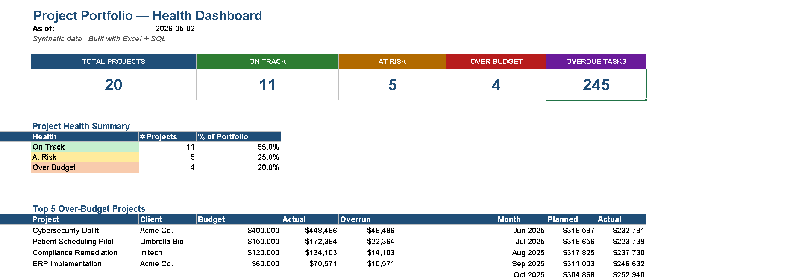
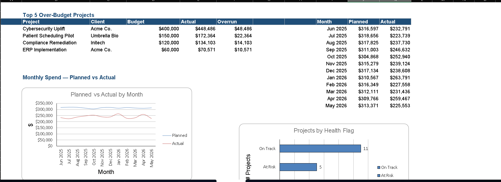
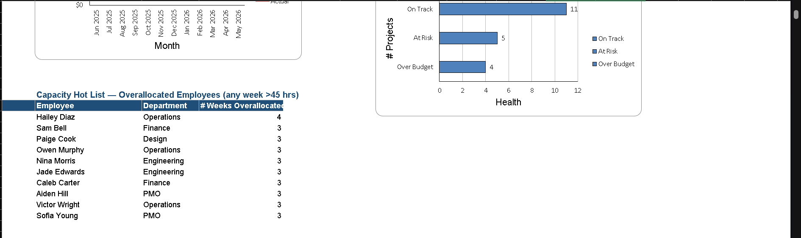
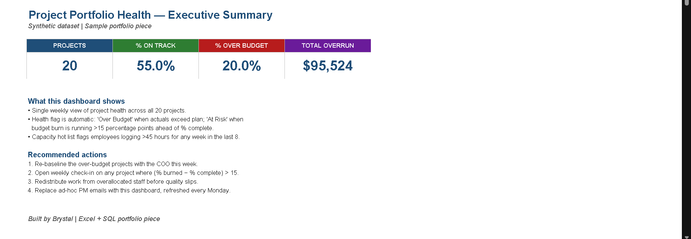
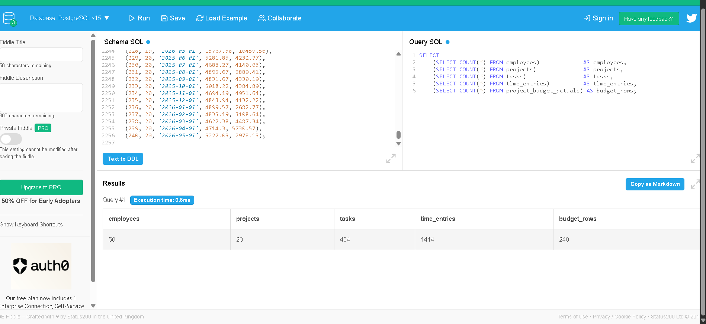
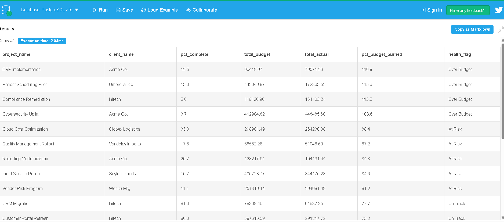
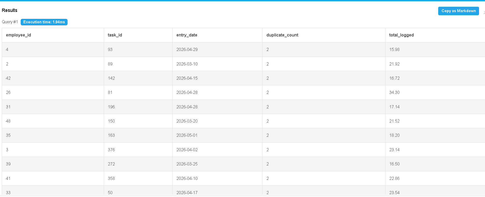

# Project Portfolio Tracker — Excel + SQL Portfolio Project

A dashboard that surfaces project health, budget overruns, and team capacity from a relational dataset. Built on synthetic data for a 50-person services firm running 20 active client projects.

## Headline numbers in this build
- **20 projects** tracked across **5 tables** (~3,000 rows total).
- **11 On Track** (55%), **5 At Risk** (25%), **4 Over Budget** (20%).
- **$95,524** total cost overrun, concentrated in 4 projects.
- **245** overdue tasks across the portfolio.
- **10 employees** overallocated for ≥3 of the last 8 weeks.
- **14 duplicate** time entries found and flagged via SQL data-quality check.

---

## The Excel dashboard

A single weekly view that replaces five PM status emails. Health flag (Over Budget / At Risk / On Track) is automatic, driven by the relationship between % budget burned and % complete.



The dashboard pulls from cleaned Data tabs underneath. Key Excel features used: tables, XLOOKUP, COUNTIFS / SUMIFS, conditional formatting (cell-value rules and color scales), bar and line charts, and KPI cards.



The capacity hot list flags any employee who logged more than 45 hours in any of the last 8 weeks. INT() with a tie-breaker decimal makes LARGE+INDEX/MATCH return distinct names instead of duplicates.



### Print-ready Executive One-Pager

A separate tab summarizes the dashboard for non-Excel-native stakeholders. Designed to be printed or screenshotted into a status email.



---

## The SQL behind it

PostgreSQL schema, 5 related tables, 8 analysis queries. Loaded via `sql/01_create_tables.sql` + `sql/04_sample_inserts.sql`. Database confirmed loaded with the expected row counts:



### Q2 — Project portfolio health (the headline query)

Two CTEs (one for task progress, one for budget rollup), a CASE statement for the health flag, and a NULLIF guard against divide-by-zero. Returns a fully-ranked portfolio with the at-risk story baked in.



The four projects flagged Over Budget — ERP Implementation, Patient Scheduling Pilot, Compliance Remediation, Cybersecurity Uplift — show the value of an automated check: each was under 13% complete but already past 100% budget burn. Two of the four belong to the same client (Acme Co.), which is its own concentrated-risk story.

### Q5 — Data-quality check: duplicate time entries

Demonstrates that "I can do data analysis" includes "I can find data problems." HAVING COUNT(*) > 1 surfaces 14 duplicate time entries that would otherwise inflate hours-logged totals.



---

## What's in this folder

| File | What it is |
|---|---|
| `project_tracker_dashboard.xlsx` | The finished workbook. Open this first. |
| `Excel_SQL_Portfolio_Guide.md` | Full strategy doc + 7 project ideas + write-up template + Project 1 walkthrough. |
| `generate_data.py` | Generates the 5 synthetic CSVs. Reproducible (seed=42). |
| `build_workbook.py` | Builds the Excel workbook from the CSVs. |
| `generate_inserts.py` | Generates `04_sample_inserts.sql` from the CSVs. |
| `data/raw/employees.csv` | 50 employees |
| `data/raw/projects.csv` | 20 projects with intentionally messy status values |
| `data/raw/tasks.csv` | 454 tasks |
| `data/raw/time_entries.csv` | 1,414 time entries (includes 14 duplicates for the data-quality demo) |
| `data/raw/project_budget_actuals.csv` | 240 monthly budget vs. actual records |
| `sql/01_create_tables.sql` | Schema (PostgreSQL) |
| `sql/02_load_data.sql` | `\copy` commands to load the CSVs |
| `sql/03_analysis_queries.sql` | 8 analysis queries (cleaning, health flags, overdue, capacity, duplicates, top-5 overrun, monthly trend, PM scorecard) |
| `sql/04_sample_inserts.sql` | INSERT statements for DB Fiddle / Supabase / pgAdmin |
| `images/` | Dashboard and SQL result screenshots |

## Workbook tabs
- **README** — what's in the workbook and how to refresh it
- **Dashboard** — KPI cards, project health summary + bar chart, top-5 over-budget table, monthly planned-vs-actual line chart, capacity hot list
- **Exec_OnePager** — print-friendly 1-page summary
- **Data_Projects** — cleaned project list with formula columns: `pct_complete`, `pct_budget_burned`, `health_flag`, `overrun`
- **Data_Tasks** — task-level data with `overdue_flag`
- **Data_TimeEntries_Wk** — weekly hours per employee with `capacity_flag`
- **Data_Budget** — monthly budget vs. actual with variance and color-scale on variance

## To regenerate everything from scratch
```bash
python3 generate_data.py     # rebuilds the 5 CSVs
python3 build_workbook.py    # rebuilds the .xlsx
python3 generate_inserts.py  # rebuilds the SQL inserts
```

---

## What this project demonstrates

**SQL:** joins across 5 tables, CTEs, CASE for status normalization and health flags, GROUP BY aggregations, date functions, duplicate detection.

**Excel:** Tables, XLOOKUP / INDEX-MATCH, COUNTIFS / SUMIFS, IFERROR, LARGE for ranking, conditional formatting (cell-value rules + color scales), bar and line charts, KPI cards, dashboard layout, print-ready exec summary.

**Business judgment:** translates query output into a recommendation a COO could act on this week — re-baseline the over-budget projects, redistribute work from overallocated staff, open a structured conversation with the concentrated client.
